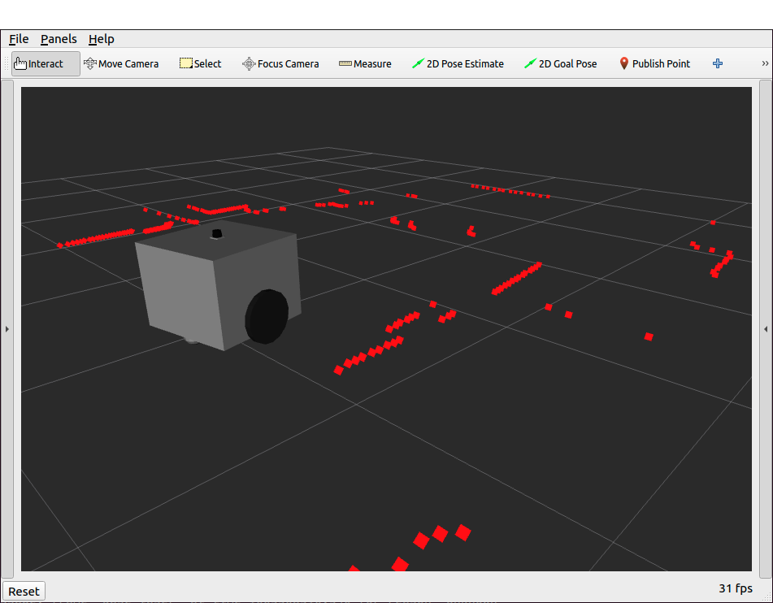
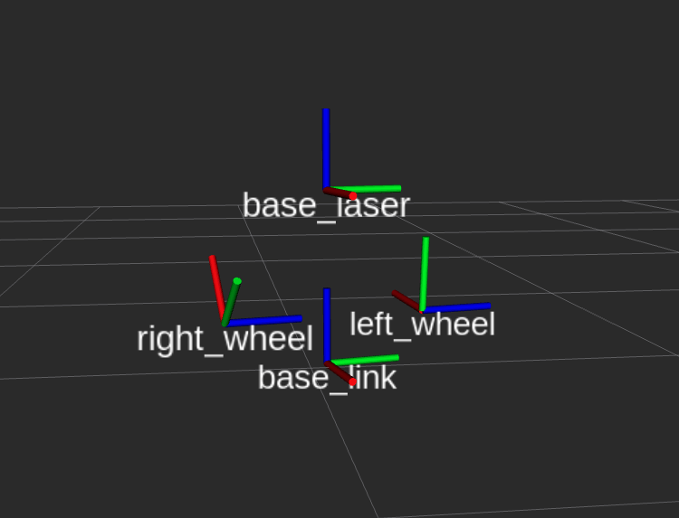

# Shelfino ROS2


This repository contains the ROS2 interface developed for the mobile robot **Shelfino** of the Department of Information Engineering and Computer Science of the University of Trento, Italy. </br>

Both a bringup node for the physical robot and a simulation of the robot itself are present here.

- [Shelfino ROS2](#shelfino-ros2)
  - [Shelfino ROS2 topics](#shelfino-ros2-topics)
  - [Docker image](#docker-image)
  - [Complete documentation](#complete-documentation)

<br/><br/>

## Install depdencies  
```
pip install shapely
sudo apt-get install libcgal-dev libcgal-qt5-dev
```
## Compile the source code
```
cd $HOME
mkdir shelfino_ws
cd shelfino_ws
mkdir src
cd $HOME/shelfino_ws/src
git clone https://github.com/Hydran00/Robot_Planning_Project.git
cd $HOME/shelfino_ws
colcon build
```

## Run
```
ros2 launch shelfino_gazebo shelfino.launch.py
```
```
ros2 launch shelfino_navigation shelfino_nav.launch.py
```
```
ros2 launch dubins_planner dubins_planner
```
## Planning
Create a Voronoi diagram for collision-free best waypoints
```
ros2 run dubins_planner rec
```

## Shelfino ROS2 topics

The topics provided by the interface are:

|       TOPIC        | Description |
| ------------------ | ----------- |
| /scan              | Data from the Lidar |
| /odom              | Data of the odometry (sensor fusion of the RealSense and encoders data) |
| /t265              | Data from the RealSense camera |
| /joint_states      | Data from the encoders of the wheels |
| /cmd_vel           | Topic to control the movement of the robot acting on the velocities |
| /robot_description | The urdf description of the shelfino robot |
| /tf_static         | The fixed transform between the *base_link* frame and the *base_laser* frame |
| /tf                | The tranforms between the robot and the *odom* frame, and between the wheels and the robot body |





---
## Docker image

You can pull the docker image containing all the ROS2 nodes of this project with: <br/>
`docker pull pla10/ros2_humble:amd64` 

---
## Complete documentation

Check the [complete documentation](https://pla10.github.io/Shelfino_ROS2) of this repository.

MULTIPOLYGON (((0 0, 6 0, 6 6, 0 6, 0 0),(4.2 0.5, 4.2 2, 5.4 0.2, 4.2 0.5),(1.2 1.2, 1.2 3, 3.2 4.5, 1.2 1.2),(4.2 3.2, 5.8 4, 4.5 5, 4.2 3.2)))
